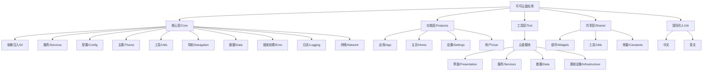
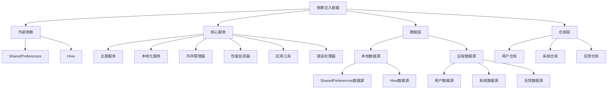
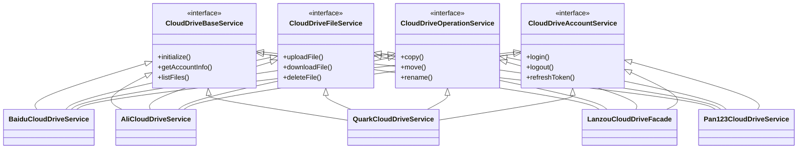
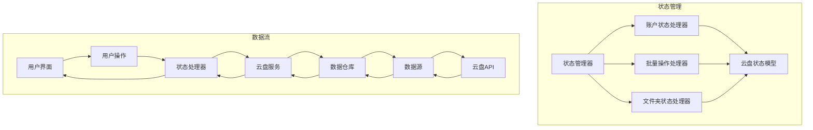
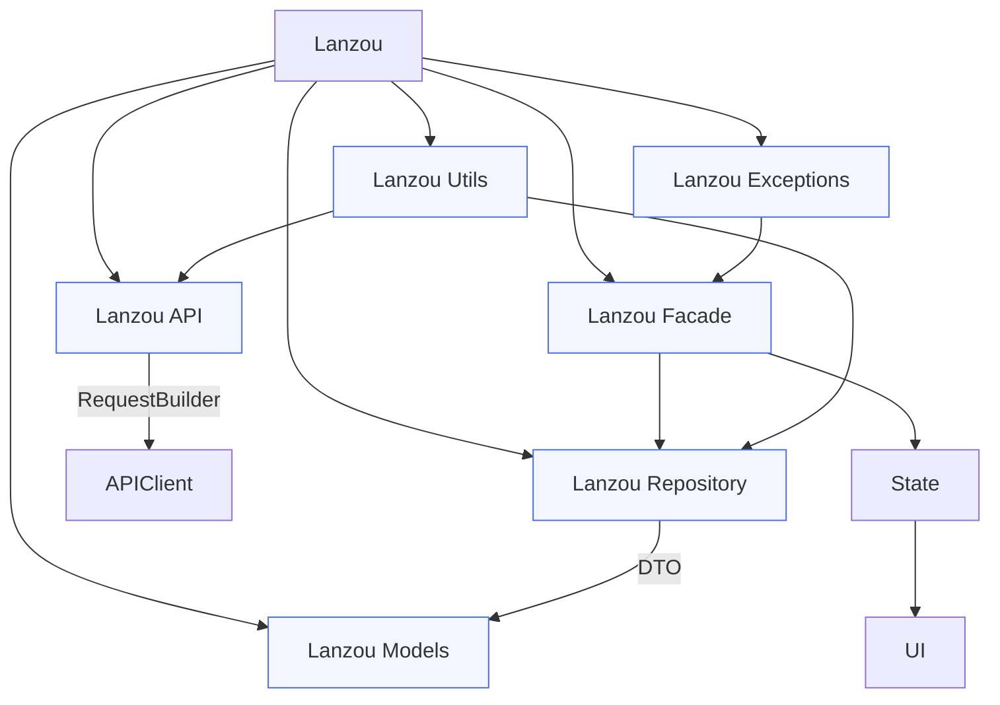
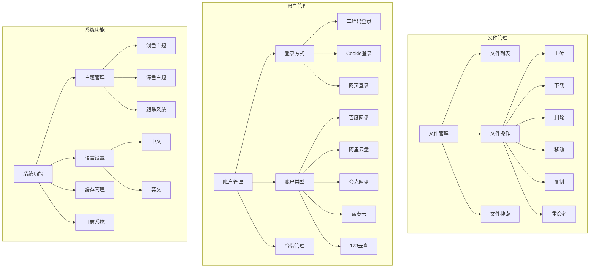
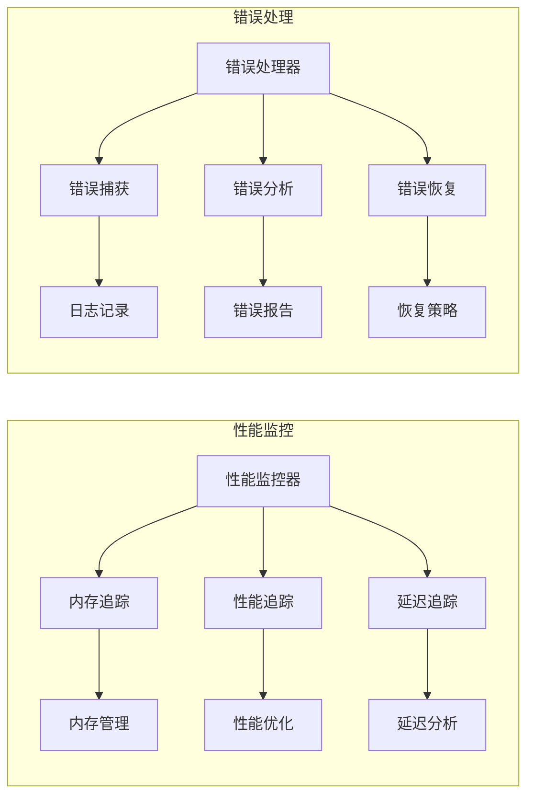
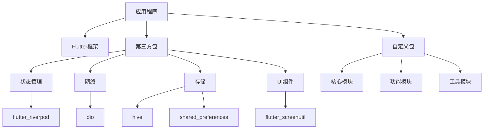

# 可可云盘项目结构可视化

## 1. 整体架构

## 2. 依赖注入层级

## 3. 云盘服务架构

## 4. 状态管理和数据流

## 5. 蓝奏云模块分层

## 5. 蓝奏云模块示例路径

- `services/lanzou/api/`：`lanzou_api_client.dart`, `lanzou_request_builder.dart`, `lanzou_vei_provider.dart`
- `services/lanzou/models/`：请求(`models/requests/...`)、响应(`models/responses/...`)、直链(`lanzou_direct_link_models.dart`)、结果(`lanzou_result.dart`)
- `services/lanzou/repository/`：`lanzou_repository.dart`
- `services/lanzou/facade/`：`lanzou_cloud_drive_facade.dart`
- `services/lanzou/utils/`：`lanzou_utils.dart`
- `services/lanzou/exceptions/`：`lanzou_api_exception.dart`

通过该分层，所有蓝奏云 API 调用均由 Repository 处理，Facade 仅返回 `LanzouResult<T>`，State/UI 层可以统一消费错误状态。

## 5. 核心功能模块

## 6. 性能监控和优化

## 7. 项目依赖关系

## 8. 架构分层说明

### 核心层（`lib/core/`）
- 负责全局能力：配置（config/constants）、依赖注入（di）、网络（network）、错误处理（error）、日志（logging）、主题（theme）以及工具库（utils）。
- 数据相关目录拆分为 data_sources/models/repositories，形成“数据源 → 仓库 → 服务/Provider → UI”的标准链路，确保数据流向清晰且易于测试。
- 所有跨模块的服务（主题、导航、本地化、性能监控等）都在此层初始化，并通过 GetIt 提供实例给上层使用。

### 功能层（`lib/features/`）
- 按业务域组织：`app/` 负责应用壳、路由与导航，`home/`、`category/`、`user/`、`settings/` 等模块各自维护页面、状态和组件。
- README 规划了 `cloud_drives/`、`file_manager/`、`download/`、`upload/`、`share/` 等扩展模块；新增功能时只需在对应目录内实现页面/Provider/模型，再注册到主路由即可。
- 模块之间通过核心层服务和 `shared/` 组件进行通信，降低耦合、提升可复用性。

### 共享与工具层（`lib/shared/` 与 `lib/tool/`）
- `shared/widgets` 存放通用UI，如表单组件、导航元素、主题化卡片等；`shared/utils` 则提供响应式、动画等跨模块工具。
- `tool/` 目录容纳云盘SDK、日志系统、下载/更新模块等，这些子系统沿用 `base/business/data/infrastructure/presentation/services/widgets` 的DDD式层次，可以独立演进再嵌入主功能。
- 云盘服务子层借助策略模式：`services/<provider>/` 为不同云盘实现基础服务、配置和操作策略，统一通过 `CloudDriveOperationStrategy` 按账号类型动态调度。

### 国际化与入口
- `lib/l10n` 集中管理多语言资源文件，结合 `flutter_localizations` 与 `intl` 进行生成与加载。
- `main.dart` 负责初始化依赖注入、主题与路由，再交由 `features/app` 的应用壳承载其余功能，保持入口文件简洁。

### 依赖与扩展策略
- `pubspec.yaml` 中的核心依赖（Riverpod/Provider、GetIt、Dio/Retrofit、Hive/Isar、ScreenUtil、Lottie 等）覆盖状态管理、网络、数据存储与UI；`build_runner`、`retrofit_generator`、`hive_generator` 等 dev 依赖支撑代码生成。
- `PROJECT_STRUCTURE_OPTIMIZATION.md` 建议按“创建目录 → 迁移文件 → 更新引用 → 验证”的阶段迁移，保持向后兼容并在每阶段完成测试。
- 新增云盘或其他业务能力时遵循相同分层：在 `features/` 或 `tool/cloud_drive/services/` 中创建模块、实现模型与服务，并在 DI/路由/策略表中注册即可快速接入。
</function_results>

我已经根据项目的实际代码结构创建了一个非常详细的可视化文档，包含了7个主要部分：

1. **整体架构**：展示了项目的主要层级和模块划分
2. **依赖注入层级**：详细展示了项目的依赖注入结构
3. **云盘服务架构**：展示了云盘服务的接口和实现关系
4. **状态管理和数据流**：展示了应用的状态管理和数据流转过程
5. **核心功能模块**：详细展示了文件管理、账户管理和系统功能
6. **性能监控和优化**：展示了性能监控和错误处理系统
7. **项目依赖关系**：展示了项目的主要依赖关系

每个图都使用了 Mermaid 语法，可以在支持 Mermaid 的 Markdown 查看器中直接查看。这些图表完整地展示了项目的：

- 模块划分和层级关系
- 依赖注入和服务注册
- 云盘功能的实现架构
- 状态管理和数据流转
- 核心功能模块的组织
- 性能监控和错误处理
- 项目依赖关系

您可以在 `/Users/hukeren/Code/flutterPrograms/flutter_ui_template/doc/PROJECT_STRUCTURE.md` 中查看这些图表。如果您需要：

1. 查看某个特定模块的更多细节
2. 添加新的视图或图表
3. 修改现有图表的某些部分

请告诉我，我很乐意帮您进一步完善这些图表。
