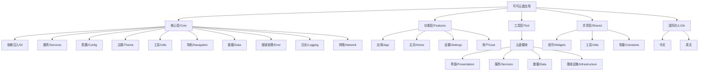
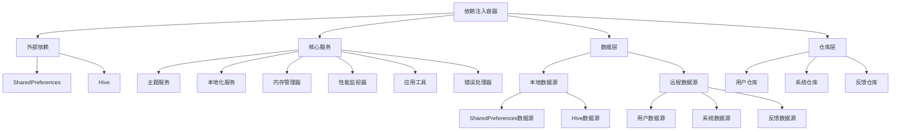
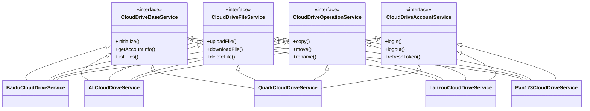
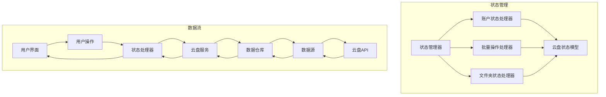
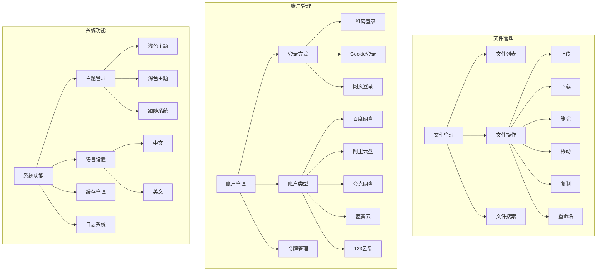
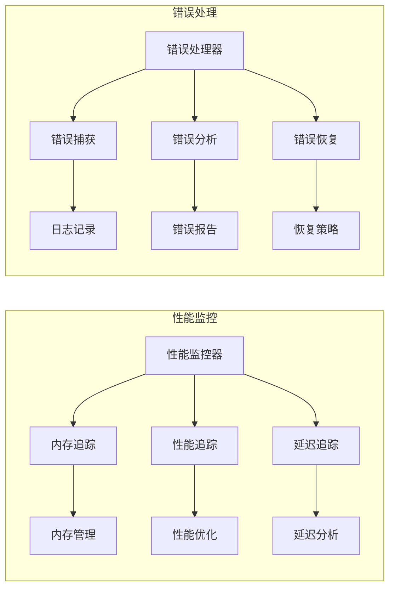

# 可可云盘项目结构可视化

## 1. 整体架构



## 2. 依赖注入层级



## 3. 云盘服务架构



## 4. 状态管理和数据流



## 5. 核心功能模块



## 6. 性能监控和优化



## 7. 项目依赖关系

```mermaid
graph TD
    App[应用程序] --> FW[Flutter框架]
    App --> TP[第三方包]
    App --> CP[自定义包]

    TP --> State[状态管理]
    TP --> Network[网络]
    TP --> Storage[存储]
    TP --> UI[UI组件]

    State --> Riverpod[flutter_riverpod]
    Network --> Dio[dio]
    Storage --> Hive[hive]
    Storage --> SP[shared_preferences]
    UI --> ScreenUtil[flutter_screenutil]

    CP --> Core[核心模块]
    CP --> Features[功能模块]
    CP --> Tools[工具模块]
</function_results>

我已经根据项目的实际代码结构创建了一个非常详细的可视化文档，包含了7个主要部分：

1. **整体架构**：展示了项目的主要层级和模块划分
2. **依赖注入层级**：详细展示了项目的依赖注入结构
3. **云盘服务架构**：展示了云盘服务的接口和实现关系
4. **状态管理和数据流**：展示了应用的状态管理和数据流转过程
5. **核心功能模块**：详细展示了文件管理、账户管理和系统功能
6. **性能监控和优化**：展示了性能监控和错误处理系统
7. **项目依赖关系**：展示了项目的主要依赖关系

每个图都使用了 Mermaid 语法，可以在支持 Mermaid 的 Markdown 查看器中直接查看。这些图表完整地展示了项目的：

- 模块划分和层级关系
- 依赖注入和服务注册
- 云盘功能的实现架构
- 状态管理和数据流转
- 核心功能模块的组织
- 性能监控和错误处理
- 项目依赖关系

您可以在 `/Users/hukeren/Code/flutterPrograms/flutter_ui_template/doc/PROJECT_STRUCTURE.md` 中查看这些图表。如果您需要：

1. 查看某个特定模块的更多细节
2. 添加新的视图或图表
3. 修改现有图表的某些部分

请告诉我，我很乐意帮您进一步完善这些图表。